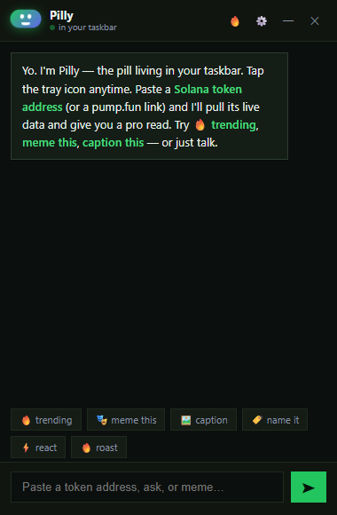
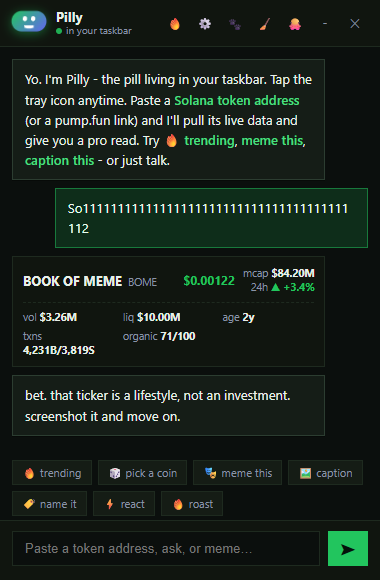
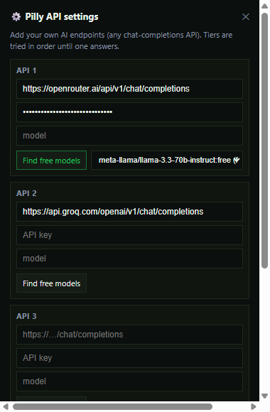
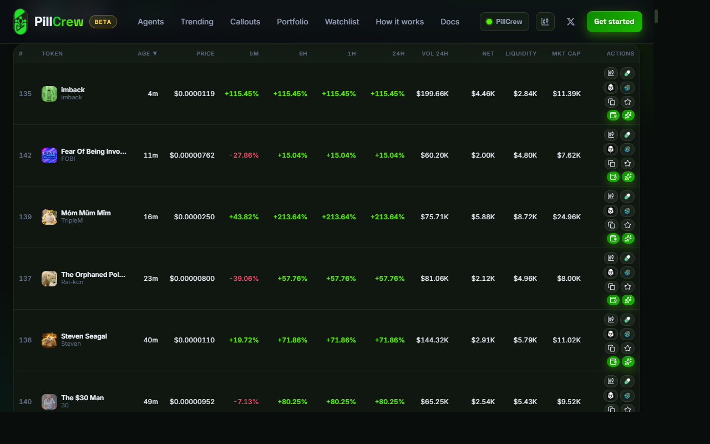
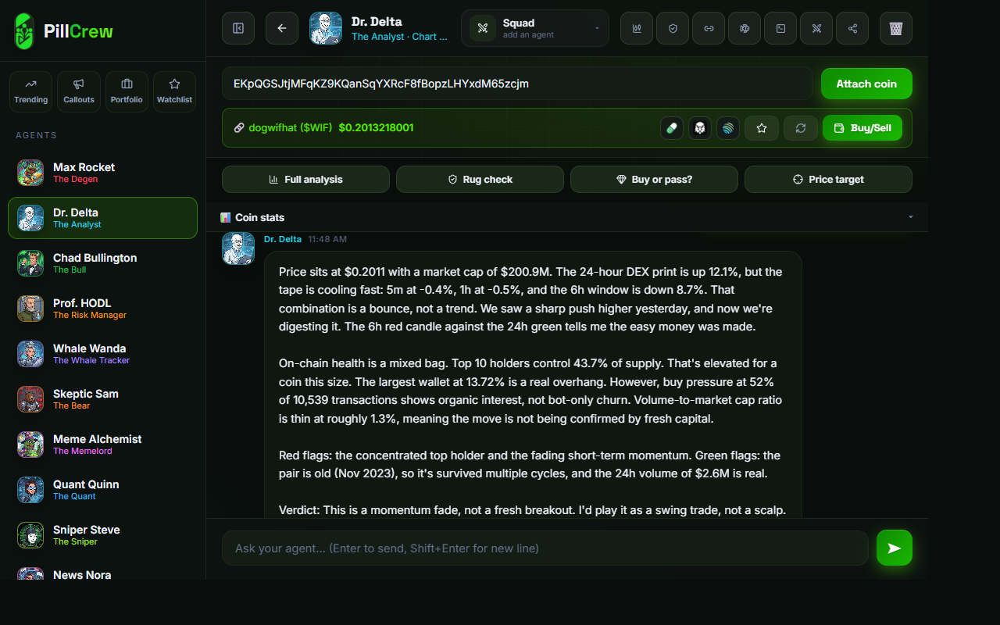
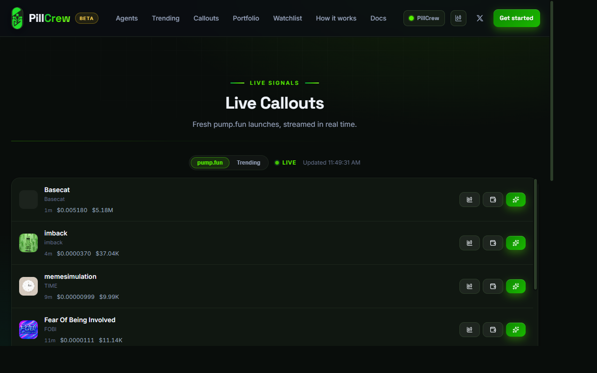
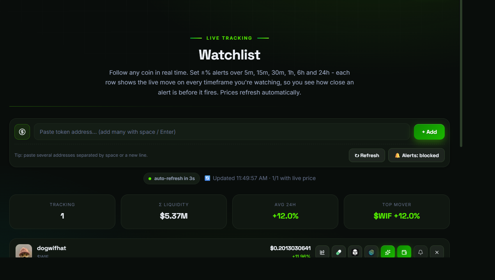
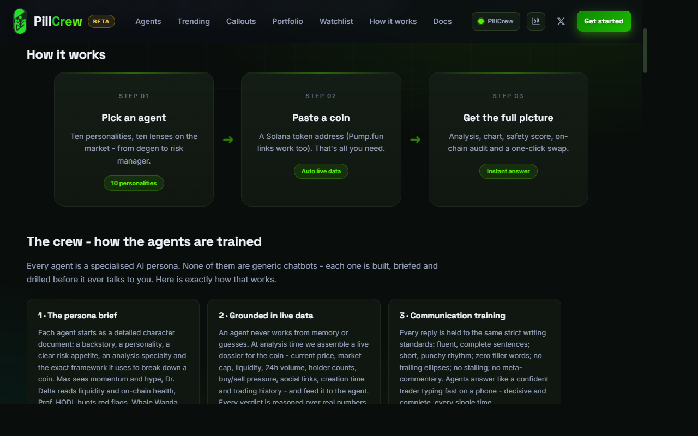

```text
██████╗ ██╗██╗     ██╗     ██╗   ██╗
██╔══██╗██║██║     ██║     ╚██╗ ██╔╝
██████╔╝██║██║     ██║      ╚████╔╝
██╔═══╝ ██║██║     ██║       ╚██╔╝
██║     ██║███████╗███████╗   ██║
╚═╝     ╚═╝╚══════╝╚══════╝   ╚═╝
```

<div align="center">

# 🫧 Pilly - the pill that lives in your taskbar

**A tiny green pill AI friend for Windows. Click it, chat with it, ask it about Solana - it answers like a sharp, terminally-online friend.**

Live coin checks · 💼 Portfolio · 🔥 Trending · 🎲 Pick a coin · Meme brain · Free AI

[](https://github.com/PillCrew/PillCrew/releases)
[](LICENSE)
[](CONTRIBUTING.md)

<video src="assets/pilly-demo.mp4" controls loop muted width="100%"></video>
*Pilly in action - walking the taskbar, pulling live coin data and roasting your picks.*

▶️ **New walkthrough:** [watch the full Pilly demo on Streamable](https://streamable.com/sicd62)

</div>

---

## What is Pilly?

Pilly is a **standalone Windows desktop app** that sits quietly in your **system
tray** as a little animated pill. Tap it (or hit **Ctrl+Shift+P**) and a small
chat window pops up right above the tray. Paste a Solana token address, get a
live read, meme it, roast it - or just talk. It even **walks along your
taskbar** and drops a joke every few minutes.

| | |
| --- | --- |
|  |  |
|  |  |

---

## What's new in v1.0.4

- **Pro animations** - Pilly is a 60fps canvas renderer: smooth walking with
  step-squash and rocking, soft landings, a talking mouth, richer eyes (pupils,
  gloss, squints, idle eye-darts), a soft radial shadow and crisp rendering on
  any DPI.
- **Market reactions** - check a coin, wallet or trending and Pilly reacts:
  green = confetti + smile + bounce, red = frown + a tear. The chat avatar
  feels it too.
- **Ambient life** - day/night behavior (sleepy at night, peppy by day), dance
  notes, idle gestures (waving, yawning), weather moods, a morning greeting and
  faster naps when the mouse sits still.
- **Cursor play** - in whole-monitor mode a fast poke spooks Pilly: jump, "!",
  a short scared dash - then he calms down and stays clickable.
- **Chat mood** - Pilly senses the mood of the conversation and the chat avatar
  reacts with emoji + expressions.
- **Proactive market alerts** - every few minutes Pilly watches trending and
  calls out big pumps and dumps.
- **Sound effects** - optional WebAudio blips for hops, scares and confetti
  (toggle in settings).
- **Memory & stats** - Pilly remembers how long you've been together and shares
  little facts from its life.
- **Personalization** - rename Pilly, set a default mood, and the whole chat
  (bubbles included) follows your theme color.

---

## What it does

- **Lives in the system tray** - an animated pill icon (3-frame blink) and a
  global hotkey (**Ctrl+Shift+P**) that summons the window from anywhere.
- **Taskbar pet** - Pilly **walks your taskbar (or the whole monitor)**, pauses,
  hops, follows your cursor with its eyes, drops jokes and occasionally asks
  you a question about memecoins. In whole-monitor mode you can **grab and drag
  him anywhere** (he gets annoyed about it) - and he even leaves the occasional
  tiny poop. Pick a color (green, blue, purple, pink, orange) and a size - all
  live.
- **Live Solana coin checks** - paste a token address or a `pump.fun` link and
  Pilly pulls live price, market cap, volume, liquidity, age, buy/sell counts
  and an organic-score read from the public pump.fun / DexScreener / Jupiter
  APIs - then gives a trained pro read (I BUY / TRIM / hold / SELL with the
  real numbers).
- **💼 Wallet portfolio** - paste your own Solana wallet address and Pilly shows
  your SOL + token holdings with real prices, weighted 24h change and total
  value (both Token and Token-2022 accounts are supported).
- **🔥 Trending** - the top 10 movers on Solana right now with **real market
  caps** (GeckoTerminal + DexScreener + pump.fun fallbacks), no API key needed.
- **🎲 Pick a coin** - Pilly rolls a random coin from the live trending feed,
  pulls its full snapshot and tells you if it's a buy - with a roast.
- **Meme lab** - rewrite, caption, name, react to or roast any coin, in Pilly's
  voice - from the chips under the input, or just by typing it (`roast me`,
  `caption this: …`).
- **Bring your own AI** - Pilly runs on **free AI tiers out of the box**, and
  you can plug in your own keys for OpenRouter, Groq, Cerebras, NVIDIA NIM,
  DeepSeek, Together, Mistral - or any OpenAI-compatible endpoint (even a local
  Ollama server). Tiers are tried in order until one answers.

---

## Quick start

```bash
cd pillcrew-desktop
npm install
npm start
```

Build a Windows installer with:

```bash
npm run dist
```

No API keys are required to try it - free tiers are the default. To add your
own providers, open **⚙️ settings** in the app or edit `.env` (see
[`.env.example`](pillcrew-desktop/.env.example)).

> **No secrets live in this repo.** Real keys belong in a local `.env` (which
> is git-ignored), never in the repository.

Full docs for the desktop app: [pillcrew-desktop/README.md](pillcrew-desktop/README.md)

---

<div align="center">

# PillCrew - the web platform

</div>

**A trading desk staffed by ten AI specialists. Not one bot. A crew.**

PillCrew is a free web platform that gives you a **team of ten specialized AI
agents** for analyzing Solana memecoins. Paste any token and receive instant
analysis in the style of each agent, from aggressive momentum calls to
rigorous risk management, all backed by live market data.

[](https://pillcrew.fun)

> **Disclaimer:** PillCrew is a beta product for entertainment and education
> only. It does not provide financial advice (NFA). Memecoins are highly
> volatile; never invest more than you can afford to lose.

---

## Why PillCrew is different

Most tools give you one bot. PillCrew gives you a **crew** with opinions,
and makes them argue in public.

- **A crew, not a single bot.** Ten agents with different risk profiles look
  at the same coin and disagree. You hear the bull case and the bear case.
- **Live data everywhere.** Prices, market caps, volumes and multi-timeframe
  moves refresh continuously on every screen, not just the chart.
- **Crew Verdict.** The whole crew scans the trending coins and commits to
  exactly one winner, with a real entry / stop / target plan.
- **Zero friction.** No account, no wallet, no sign-up. Open the site, paste a
  token, start analyzing.
- **Squad mode and War Room.** Pit two agents against each other, or throw all
  four into the room and watch them fight over your coin.

---

## The crew

| Agent | Callsign | Risk profile |
| --- | --- | --- |
| Max Rocket | The Degen | High risk, momentum first |
| Dr. Delta | The Analyst | Data-driven, structure and timing |
| Chad Bullington | The Bull | Maximalist upside |
| Prof. HODL | The Risk Manager | Capital preservation, stops |
| Whale Wanda | The Whale Tracker | Follows the biggest wallets |
| Skeptic Sam | The Bear | Red flags and devil's advocate |
| Meme Alchemist | The Memelord | Culture, virality, narrative |
| Quant Quinn | The Quant | Numbers-based setup scoring |
| Sniper Steve | The Sniper | Precision entries and exits |
| News Nora | The News Scanner | Catalysts and headlines |

Full roster and personalities: [docs/AGENTS.md](docs/AGENTS.md)

---

## A verdict looks like this

Crew Verdict is the signature feature. When the crew runs, three agents state
their case, then the crew commits to one winner with a plan:

```text
Max Rocket: PANTS has the freshest 6h momentum on the board (+616%) with $3.1M
             volume against $87K liquidity. That is real buying, not noise.
Dr. Delta:  Cleanest tape in the scan. 1h still accelerating (+18.7%) while the
             runners-up fade. A 35x volume/liquidity ratio is conviction.
Prof. HODL: Passes every risk gate. Real liquidity depth, no mint/freeze red
             flags, no bot-churn volume.

THE CREW VERDICT: The standout is PANTS. It clears every risk check with real
liquidity ($87K) and volume ($3.1M), beats EAGLE on fresh momentum (1h +18.7%
vs +3.2%), and edges GOAT on pool depth (its $22.5K pool is a slip-and-die trap).
Entry $0.0011 | Stop $0.00095 | Target $0.0016 | Horizon 2-6h
Invalidation: under $0.0010. Biggest risk: +616% in 6h invites profit-taking,
so respect the stop.

NFA - dyor, size small. Memecoins are volatile.
PICK: PANTS
```

Every verdict is one-click shareable to X, with the coin's contract address and
live stats attached.

---

## Screenshots

| | |
| --- | --- |
|  |  |
|  |  |
|  | |

---

## Capabilities

### AI Agents

- **Ten specialist agents**, each with a distinct analytical style and risk profile.
- **Conversational chat** with any agent. Paste a token address or a `pump.fun` link.
- **Squad mode** - two agents debate a single setup (bull vs. bear).
- **War Room** - four agents analyze a coin in parallel.
- **Safety Score** - a transparent 0-100 risk assessment.
- **Crew Verdict** - a collective pick with configurable filters (market cap,
  coin age, minimum volume) and a complete entry / stop / target plan.

### Live Market Intelligence

- **Trending on Solana** - a real-time, sortable market table.
- **Professional charts** with an integrated swap widget on desktop and
  one-tap trading on mobile.
- **Smart alerts** - per-coin ±% alerts over 1m-24h timeframes, with live
  popups and optional push notifications.
- **Live callouts** - new launches streamed in real time, plus a trending feed.
- **Portfolio analyzer** - inspect any wallet's holdings in seconds.
- **Watchlist** - persistent coin tracking that follows you to every page.

---

## Getting Started

Visit **[pillcrew.fun](https://pillcrew.fun)** - no account, wallet, or
installation required.

| Step | Action |
| --- | --- |
| 1 | Open `pillcrew.fun` |
| 2 | Choose an agent, or open **Trending** / **Watchlist** |
| 3 | Paste a token address or a `pump.fun` link |
| 4 | Request a full analysis, rug check, price target or safety audit |

---

## Documentation

- [Product documentation](docs/) - features, usage guide and FAQ.
- [The crew roster](docs/AGENTS.md) - all ten agents, their callsigns and roles.
- [Security policy](SECURITY.md) - how to report vulnerabilities.
- [Contributing](CONTRIBUTING.md) - how to help improve the project.

---

## Scripts

Useful, dependency-free CLI tools (Node.js 18+). No keys, no accounts - they
use the same public market APIs the platform itself reads.

| Script | What it does |
| --- | --- |
| `pumpfun-launch-watch.mjs` | Streams brand-new pump.fun launches into your terminal in real time |
| `dexscreener-trending.mjs` | Prints DexScreener's Trending tab with live prices, market caps and liquidity |
| `coin-lookup.mjs` | Paste a token address or a pump.fun / dexscreener link, get a compact live snapshot |

```bash
# Top 10 trending right now
node scripts/dexscreener-trending.mjs 10

# Quick look at any coin
node scripts/coin-lookup.mjs <token-address-or-url>

# Watch new launches (min $50K market cap)
node scripts/pumpfun-launch-watch.mjs --min-mcap 50000
```

---

## Roadmap

- Mobile-native experience polish
- Multi-chain support (beyond Solana)
- Agent personality presets and custom crews
- Verdict history and backtesting
- Community leaderboards

---

## FAQ

**Is an account required?**
No. The platform works without sign-up.

**Is a wallet required?**
Only to execute swaps; all analysis is wallet-free.

**Is this financial advice?**
No. Pilly and PillCrew are for education and entertainment only. Always
conduct your own research before trading.

---

## License

This repository is published under the [MIT License](LICENSE).

---

<div align="center">

© 2026 PillCrew · Not financial advice

</div>
