<div align="center">

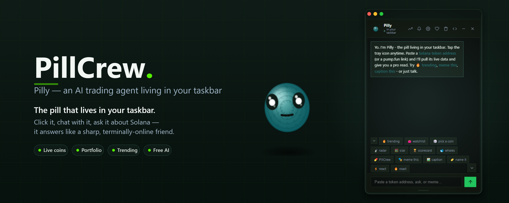

# 💊 Pilly Desktop

A tiny green pill AI friend that **lives in your Windows taskbar**. Click it, chat with it (free AI), and it answers like a sharp, terminally-online friend - short enough to screenshot.

Pilly is an original PillCrew character - its own persona, prompts and meme brain.

[](https://github.com/PillCrew/PillCrew/releases)
[](LICENSE)

</div>

---

## What it does

- **Sits in the system tray** - a little green pill with eyes, gently bobbing.
- **One click = chat** - a small frameless window pops up right above the tray icon.
- **Free AI** - talks through your own API settings (**Settings** in the chat: paste any chat-completions endpoint and key, pick a free model with one click, test, done).
- **Live Solana data (pro)** - paste a token address or a pump.fun/jup.ag link and Pilly pulls live data from free APIs (pump.fun, DexScreener, GeckoTerminal, Jupiter intel): price, mcap, volume, liquidity, 24h change, age, buy/sell txns, organic score, verification, holder/audit flags - then gives a trained pro read (I BUY / TRIM / hold / SELL with the real numbers).
- **Trending** - one click pulls the hottest Solana coins right now with **real market caps** (GeckoTerminal + DexScreener + pump.fun) and a short rundown.
- **Wallet portfolio** - paste your Solana wallet address and Pilly lists your SOL + token holdings with real prices, weighted 24h change and total value (both Token and Token-2022 accounts).
- **Watchlist PnL summary** - set an entry price on any watched token and the watchlist rolls it up into a one-glance portfolio strip: Avg / Best / Worst and how many tokens are tracked. Green when you're up, red when you're down.
- **Taskbar pet (pro animations)** - a 60fps canvas renderer. Pilly walks the
  taskbar (or the whole monitor) with smooth step-squash and rocking, soft
  landings, a talking mouth, richer eyes (pupils, gloss, squints, eye-darts)
  and a soft radial shadow - crisp on any DPI.
- **Market reactions** - check a coin, wallet or trending and Pilly reacts to
  the market: green = confetti + smile + bounce, red = frown + a tear.
- **Ambient life** - day/night behavior, dance notes, idle gestures (wave /
  yawn), weather moods, a morning greeting, and naps when the mouse is idle.
- **Cursor play** - in whole-monitor mode a fast poke spooks Pilly: jump,
  "!", a short scared dash - then he calms down and stays clickable.
- **Chat mood** - the chat avatar senses the mood of your messages and the
  market, and reacts with emoji + expressions (plus click = boop, hold = pet).
- **Market alerts** - Pilly watches trending every few minutes and calls out
  big pumps and dumps.
- **Sound effects** - optional WebAudio blips (hop, scare, confetti, sad,
  sleep) - toggle in settings.
- **Memory & stats** - Pilly counts jokes, coins, scares and days together,
  and shares little facts from its life.
- **Personalization** - rename Pilly, set a default mood, and the whole chat
  (bubbles included) follows your theme color.
- **Meme brain** - detects what you want and switches mode (from the chips, or just by typing it - `roast me`, `caption this: …`):
  - `meme this` → rewrites your text in meme-native language
  - `caption this` → a punchy meme caption
  - `name this` → an absurd coin / token / character name
  - `react` → a short, terminally-online reaction
  - `roast` → a playful light roast
- **Short replies** - everything fits in a screenshot, never over-explains a joke.
- **Hotkey** - `Ctrl+Shift+P` summons Pilly from anywhere.
- **Start with Windows** - optional, from the tray menu.
- **Auto-update** - Pilly checks GitHub for new releases when you open it and updates itself; the installed build restarts into the new version (the portable .exe links you to the releases page instead).
- **Settings polish** - the window position is remembered automatically, with one-click **Reset window position** if Pilly ever lands off-screen (tray menu still has it too).

## Screenshots

| | | |
| --- | --- | --- |
| 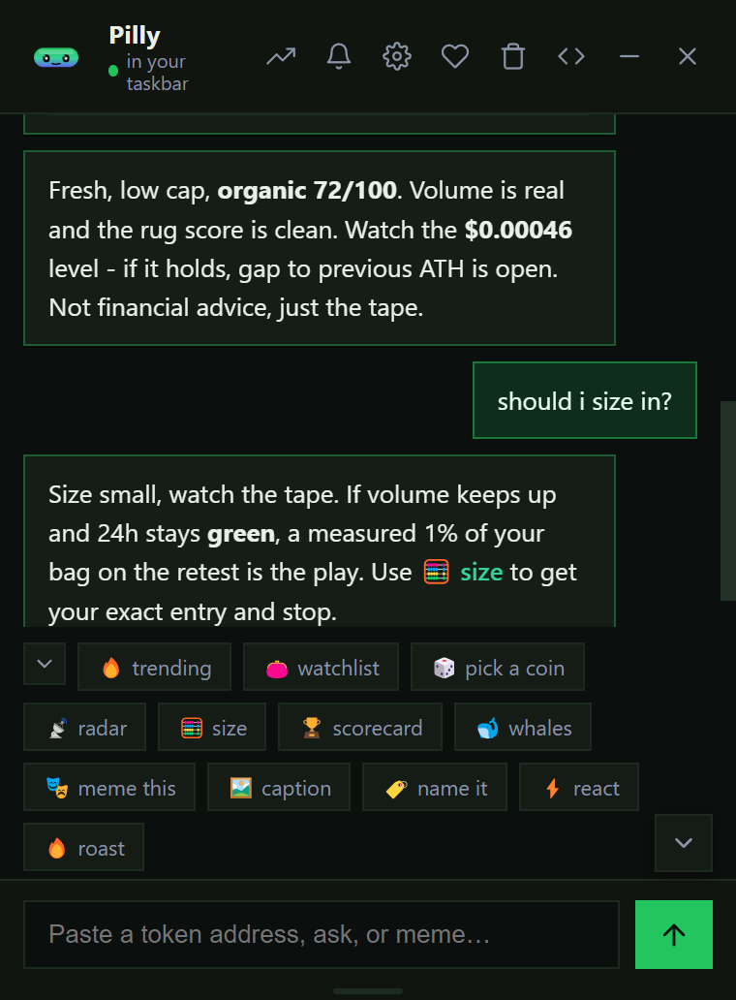 | 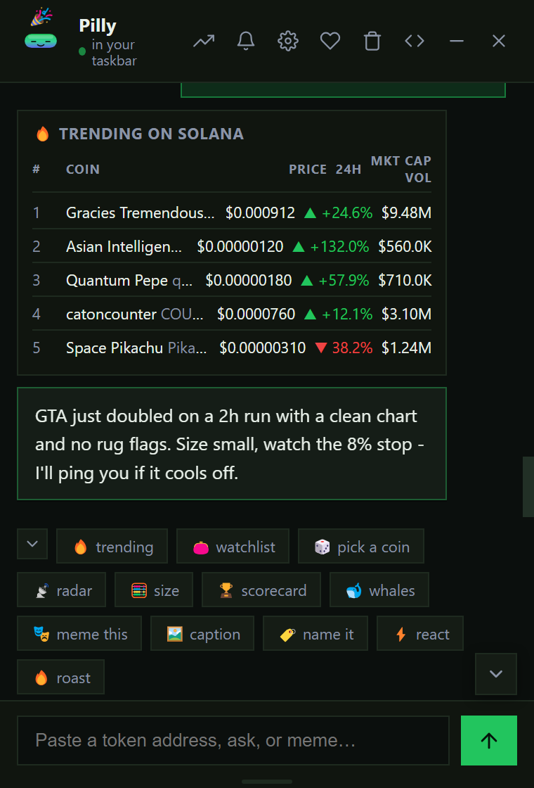 | 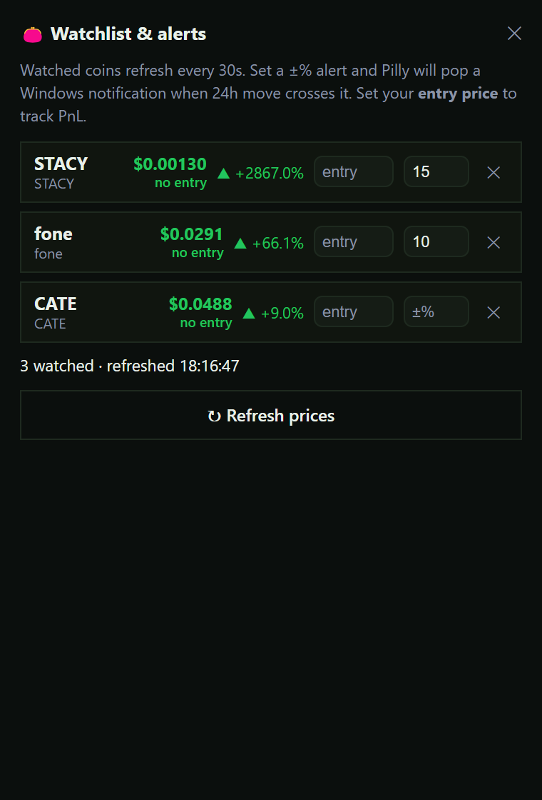 |
| 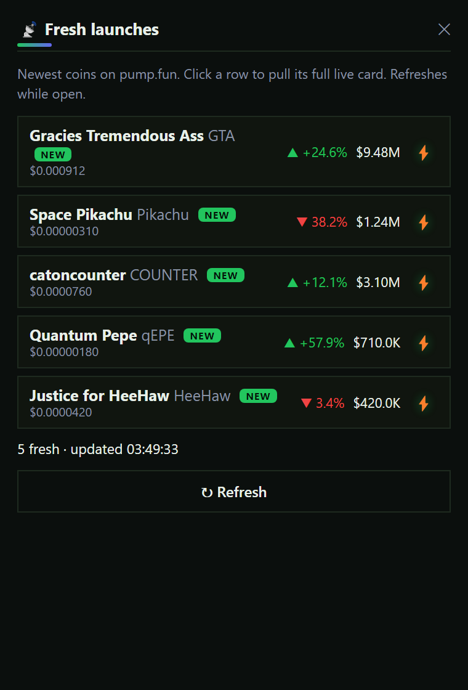 | 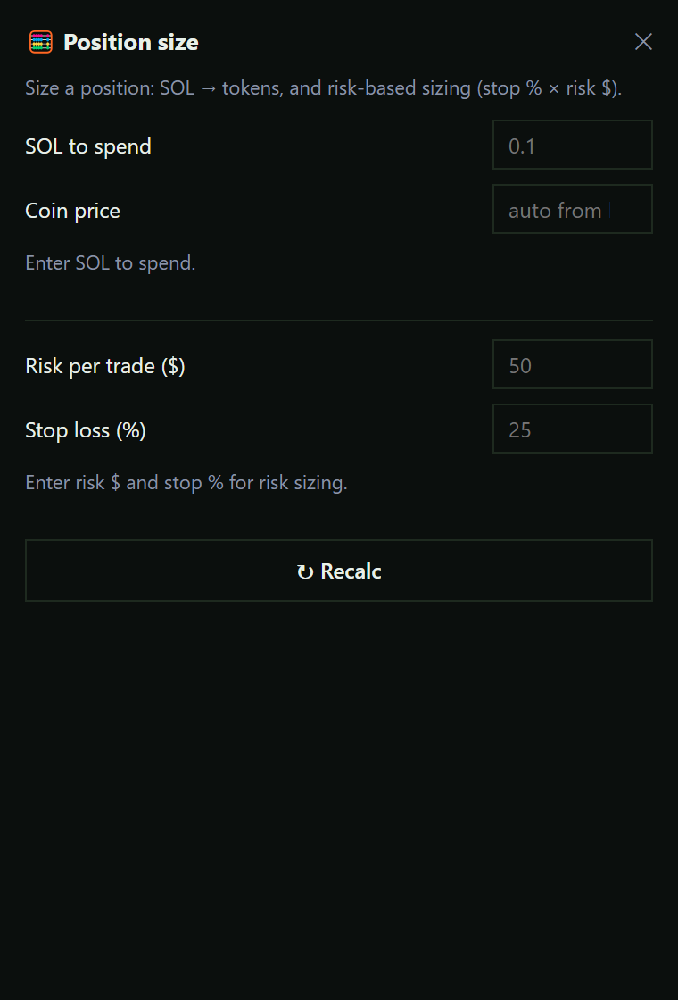 | 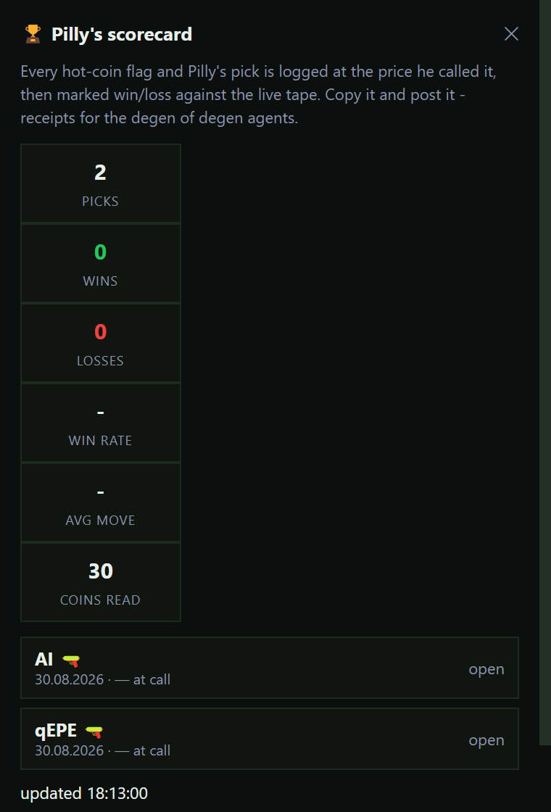 |
| 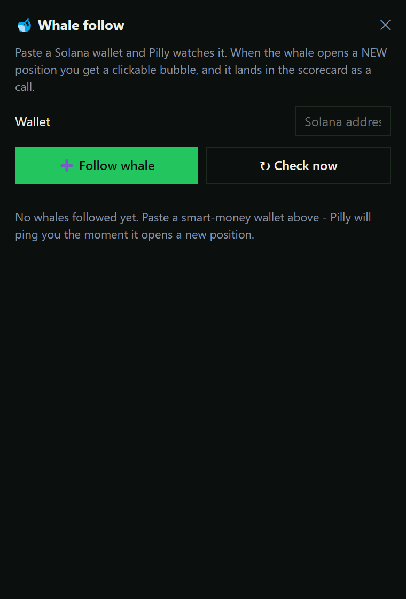 | 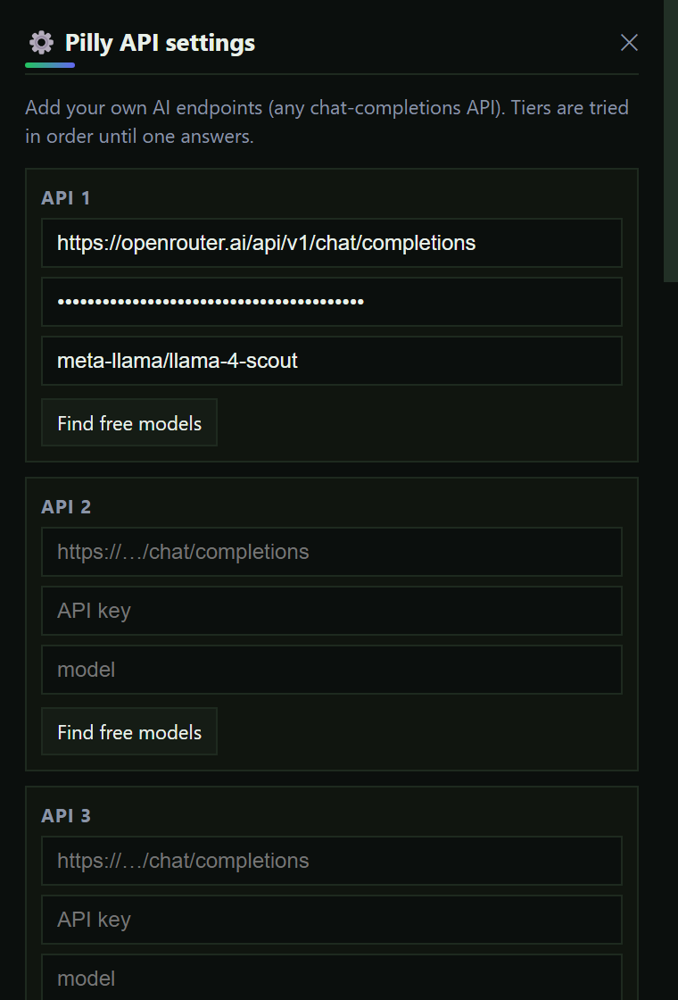 | |

## What's new

### v1.1.0

Pilly is now a **living creature**, not just a pet. This release is all about
the little things that make it feel alive on your screen - more animation,
more personality, and a cleaner, more polished UI.

#### A living Pilly
- **More animation** - Pilly blinks, sways, hops and celebrates green candles,
  naps when you're away, and reacts when you poke it.
- **Better look & expression** - cleaner blinking, glossier eyes, squints and
  idle eye-darts. The little mark above its forehead now reads as a deliberate
  detail, not a glitch.
- **Fix: Pilly is never hidden behind the cloud.** When Pilly sits at the top
  of the screen, the chat bubble now flips below it, so you always see the
  whole creature.
- **Fix: smoother idle reactions** - the sway / heart animations no longer
  judder while Pilly waits.

#### Watchlist PnL summary
- The watchlist now rolls your positions into a one-glance strip: **Avg**,
  **Best**, **Worst** and how many tokens you're tracking - green when you're
  up, red when you're down.

#### Polished panels
- Every panel layout is tighter and cleaner - no broken spacing, no runaway
  windows.
- **Reset window position** - if Pilly ever lands off-screen, one click snaps
  it back (also in the tray menu).

#### Automatic updates
- Pilly now checks for new releases on startup and downloads them in the
  background - install it with one click and you're always on the latest build.
- The portable build can't self-update, so it points you straight to the
  newest installer on GitHub instead.

### v1.0.5

Pilly levels up from a chat buddy to a **proactive market companion**. Everything
in v1.0.4 is still there - live coin checks, trending and chat - and now Pilly
also watches, tracks, scores and follows the market for you.

#### Watchlist & price alerts
- Watch any coin from the chat or a coin card in one click.
- Set a **±% price alert** per coin; Pilly polls live prices and raises a native
  Windows notification the moment your level is hit.
- Persists across restarts and follows you to every panel.

#### PnL tracking
- Your **entry price** is captured automatically the moment you watch a coin.
- Live **PnL%** per position, colour-coded green / red, right in the watchlist.

#### Pilly's Scorecard
- Every proactive call - **hot radar**, **Pilly's pick**, **whale signal**,
  **sniper** - is timestamped with the price at call time.
- Picks are later **resolved win/loss** against live prices.
- Tracks **total calls, win rate, average move and best call**. A real,
  on-chain-verifiable track record, not vibes.

#### Whale Follow
- Follow whale wallets and let Pilly **diff their holdings between polls**.
- Native alert when a followed whale opens a **NEW position** - an early
  accumulation signal.

#### Radar (fresh launches)
- A live stream of brand-new Solana launches with **age, price and market cap**.
- **NEW flags** highlight coins that just came up.

#### Position-size calculator
- Size a trade from **price, capital, risk % and stop-loss**, with breakeven
  worked out for you.

#### Deeper settings
- **Proactive features** toggles: hot-mover alerts, alert sound, morning brief
  (SOL + your PnL), Pilly's pick, sniper, whale alerts and portfolio mood.
- **Pet & chat look**: pick a bubble style (default / light / glass / neon /
  comic / minimal), bubble text size and chat bubble style.
- **Volume control** for Pilly's sounds.

| | | |
| --- | --- | --- |
| 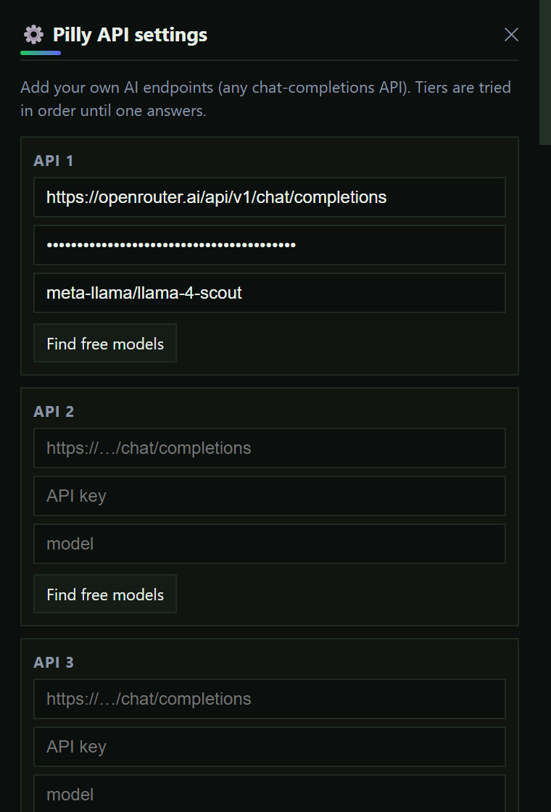 | 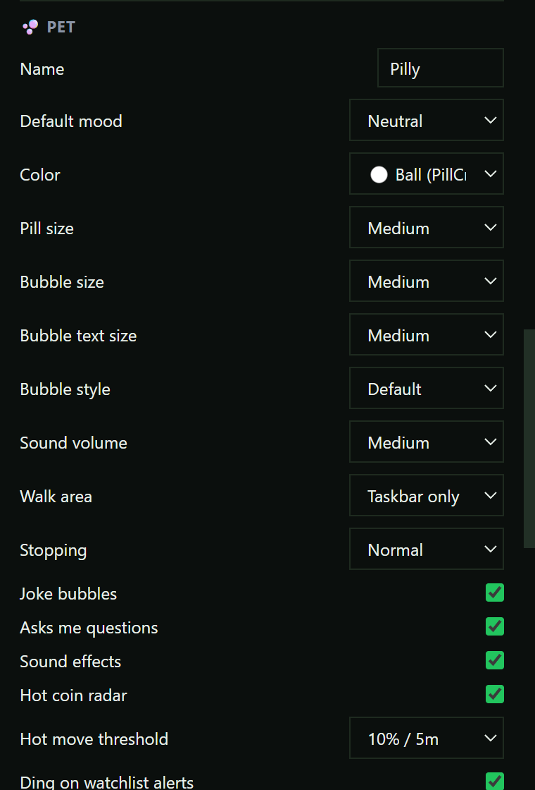 | 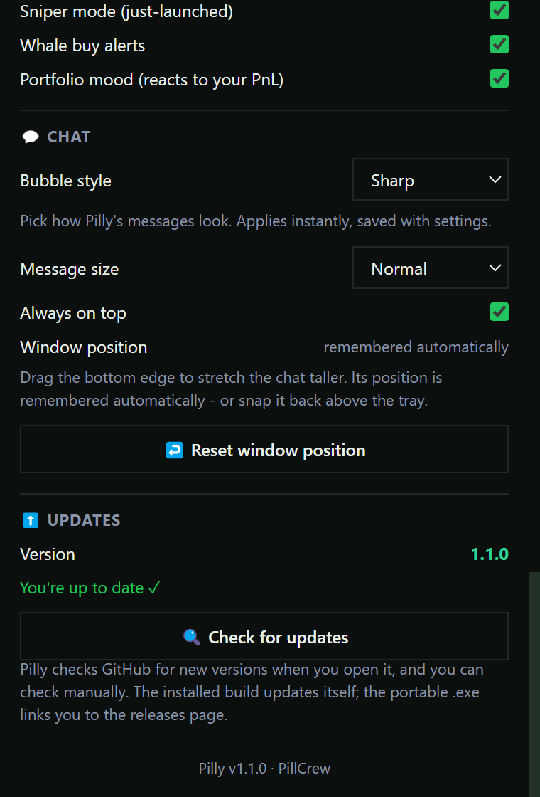 |

#### Smarter chat
- The chat now understands **"watchlist"**, **"alerts"** and **"score"** commands,
  so you can manage your list, set price alerts and check Pilly's scorecard
  without leaving the conversation.

### v1.0.4

- **Pro animations** - Pilly is a canvas renderer with smooth walking,
  step-squash and rocking, soft landings, a talking mouth, richer eyes (pupils,
  gloss, squints, idle eye-darts), a soft radial shadow and crisp rendering on
  any DPI.
- **Market reactions** - check a coin, wallet or trending and Pilly reacts:
  green = confetti + smile + bounce, red = frown + a tear. The chat avatar
  feels it too.
- **Ambient life** - day/night behavior (sleepy at night, peppy by day), dance
  notes, idle gestures (waving, yawning), weather moods, a morning greeting and
  faster naps when the mouse sits still.
- **Cursor play** - in whole-monitor mode a fast poke spooks Pilly: jump, "!",
  a short scared dash - then he calms down and stays clickable.
- **Chat mood** - Pilly senses the mood of the conversation and the chat avatar
  reacts with emoji + expressions.
- **Proactive market alerts** - every few minutes Pilly watches trending and
  calls out big pumps and dumps.
- **Sound effects** - optional WebAudio blips for hops, scares and confetti
  (toggle in settings).
- **Memory & stats** - Pilly remembers how long you've been together and shares
  little facts from its life.
- **Personalization** - rename Pilly, set a default mood, and the whole chat
  (bubbles included) follows your theme color.

## Run it

Requires **Node.js 20+**.

```bash
cd pillcrew-desktop
npm install        # also generates the tray icons
cp .env.example .env
npm start
```

### Config (`.env`)

Pilly talks to any OpenAI-compatible chat-completions API. Put one (or several
as fallbacks) in `.env`:

```
PILLY_TIER1_URL=https://...chat/completions
PILLY_TIER1_KEY=...
PILLY_TIER1_MODEL=...
PILLY_TIER2_URL=...
...
```
> **Tip:** Put any endpoint into `PILLY_TIER1_URL`, its key into `PILLY_TIER1_KEY` and
> its model into `PILLY_TIER1_MODEL` (most providers require one). Add more tiers
> as fallbacks - they are tried in order, cheapest/free first.

Tune with `PILLY_TEMPERATURE` and `PILLY_MAX_TOKENS`.

**Or set it all in the app** - click **Settings** in the chat window: 3 API slots
(URL / key / model), **Find free models**, a **Test connection** button and
temperature. Saved on disk, no file edits.

> **No secrets live in this repo.** Real keys belong in a local `.env` (which is
> git-ignored), never in the repository.

### Which API for which AI (chat-completions format)

| Provider | API URL | Key from | Notes |
|---|---|---|---|
| OpenRouter | `https://openrouter.ai/api/v1/chat/completions` | openrouter.ai → Keys | One key, many models; free models end with `:free` |
| Groq | `https://api.groq.com/openai/v1/chat/completions` | console.groq.com | Very fast, free tier, generous limits |
| Cerebras | `https://api.cerebras.ai/v1/chat/completions` | cloud.cerebras.ai | Fast inference, free tier |
| NVIDIA NIM | `https://integrate.api.nvidia.com/v1/chat/completions` | build.nvidia.com | Free credits, strong open models |
| DeepSeek | `https://api.deepseek.com/chat/completions` | platform.deepseek.com | Cheap, strong reasoning |
| Together AI | `https://api.together.xyz/v1/chat/completions` | api.together.xyz | Many open models, cheap |
| Mistral | `https://api.mistral.ai/v1/chat/completions` | console.mistral.ai | Free tier available |
| Any OpenAI-compatible | `https://…/v1/chat/completions` | - | Also local: Ollama / LM Studio on `http://localhost:11434/v1` |

Auth is `Bearer <key>`. Leave Model empty if the endpoint defaults it.

## Build an installer

```bash
npm run dist
```

Outputs an NSIS installer + portable `.exe` in `dist/`.

## Tests

```bash
npm test
```

## Troubleshooting

**The chat window froze or stopped responding.**

1. **Close it** – right-click the tray icon → **Quit Pilly**. If the window is
   really stuck (can't click anything), end it from the taskbar: `Ctrl+Shift+Esc`
   → find **Pilly / electron.exe** → *End task*.
2. **Open it again** – the chat history, watchlist, PnL and settings are all
   saved on disk, so nothing is lost. Click the tray icon to reopen.
3. **Still freezing?** – it's almost always the free AI endpoint being slow or
   rate-limited (the coin/watchlist data is local and fast). Give it a few
   seconds – Pilly retries and falls back to a local read for coins. You can
   also lower the load: close the **radar** panel (it refreshes every 60 s)
   and the **watchlist** panel.

**The window closed but the app still runs.** That's normal – closing the chat
only hides it (Pilly stays in the tray). Reopen with the tray icon or the
`Ctrl+Shift+P` hotkey. If it truly died, right-click the tray icon → Quit, then
start Pilly again.

**Pilly is "gone" (no tray icon).** Restart the app. If it won't start at all,
check that a previous instance isn't holding it: `Ctrl+Shift+Esc` → end all
`electron.exe` processes, then start Pilly again.

**Coin paste shows "no data".** The free market APIs are throttled sometimes –
retry in a few seconds. Pilly pulls from 4 sources (pump.fun, DexScreener,
Jupiter, GeckoTerminal) with automatic retries, so a temporary 429 usually
clears itself.

**Worst case / factory reset.** Quit Pilly, then delete these files in
`%APPDATA%\pilly-desktop\` (or the productName folder) to reset only that part:
- `pilly-settings.json` – API settings & preferences
- `pilly-watchlist.json` – watched coins
- `pilly-pnl.json` – entry prices (PnL)
- `pilly-window.json` – window position
- `pilly-stats.json` – Pilly's memory/stats

Deleting all of them gives you a fresh install-like state.

## How it's built

```
pillcrew-desktop/
├── main.js            # Electron: tray, window, hotkey, IPC
├── preload.js         # safe bridge to the renderer
├── src/
│   ├── ai.js          # free AI chain + short-reply clamp
│   ├── pilly.js       # Pilly's persona + meme task briefs
│   └── meme.js        # client-side request-type detection
├── renderer/          # chat window (animated pill, bubbles, chips)
├── scripts/gen-icon.js# zero-dep tray icon generator (pure Node)
├── assets/            # generated pill PNGs
└── .env.example
```

## Build & auto-update

Build the Windows installers locally:

```bash
npm run dist        # builds the NSIS installer + portable .exe (no upload)
```

To build **and publish a GitHub release** (so Pilly can self-update), create a
personal access token with the `repo` scope for your GitHub account and run:

```bash
# PowerShell (Windows)
$env:GH_TOKEN="<your-github-token>"
npm run dist:publish
```

The first run publishes a GitHub Release with the NSIS installer and a
`latest.yml` manifest. Newer `dist:publish` runs upload a fresh version and
Pilly's installed build detects it and updates itself. The portable `.exe`
can't self-update - it links to the releases page instead.

## Disclaimer

Pilly is a fun tool for entertainment and education. It is **not financial advice (NFA)** - always do your own research.

---

MIT © PillCrew
